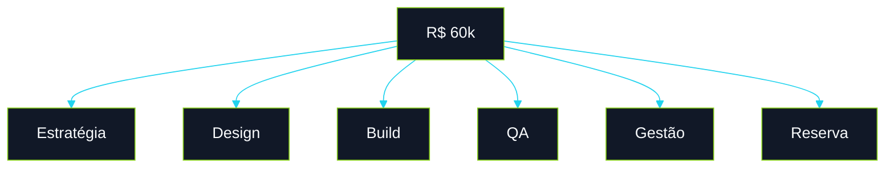
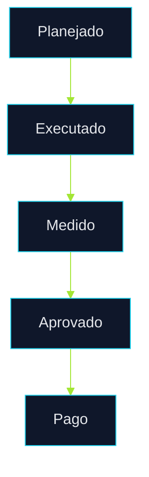

# 💰 Terra Conecta

## Documento Financeiro Executivo Estratégico

> Planejamento econômico, matriz de investimento, governança financeira e visão de implantação do Terra Conecta em padrão executivo institucional, com foco em geração de valor, segurança da decisão e convencimento executivo para aprovação da proposta.

---

## Sumário

1. Contexto Executivo
2. Estratégia Financeira
3. Estrutura do Investimento
4. Matrizes de Gastos
5. Cronograma Econômico
6. Modelo Comercial
7. Governança Financeira
8. Fluxo Operacional do Projeto
9. Indicadores de Viabilidade
10. Expansão Pós-Protótipo
11. Conclusão Executiva

---

# 1. Contexto Executivo

A presente proposta foi estruturada para oferecer ao contratante uma decisão de investimento segura, racional e orientada a impacto. Em vez de iniciar por uma operação extensa e de maior risco, o modelo recomendado valida rapidamente o potencial do projeto, transforma visão em evidência concreta e cria base objetiva para expansão posterior.

O Terra Conecta foi concebido como uma plataforma digital de impacto produtivo e social voltada ao fortalecimento de agricultoras familiares beneficiárias de Quintais Produtivos. Sob a ótica financeira, o projeto foi estruturado para equilibrar três vetores críticos: velocidade de implantação, responsabilidade orçamentária e capacidade futura de expansão.

O investimento inicial de **R$ 60.000,00** corresponde à fase estratégica de prototipação executiva. Essa etapa valida aderência funcional, experiência de uso, valor institucional e maturidade do conceito. Após a validação inicial, o projeto completo evolui para um ciclo estimado entre **3 e 4 meses**.

---

# 2. Estratégia Financeira

A lógica econômica adotada não trata o aporte como despesa isolada, mas como formação de ativo digital validável. O capital inicial reduz incerteza, antecipa aprendizados e prepara uma base sólida para execução ampliada.

## Diretrizes Financeiras

* investimento progressivo por fase;
* controle de escopo e previsibilidade;
* foco em entregas mensuráveis;
* priorização de valor demonstrável;
* baixo desperdício operacional;
* evolução guiada por validação real.

---

# 3. Estrutura do Investimento

| Fase   | Objetivo                      | Horizonte   |
| ------ | ----------------------------- | ----------- |
| Fase 1 | Protótipo executivo funcional | 15 dias     |
| Fase 2 | Implantação principal         | 3 a 4 meses |
| Fase 3 | Escala e integrações          | Evolutivo   |

## Composição do Aporte Inicial

| Componente             |         Valor |
| ---------------------- | ------------: |
| Produto e Planejamento |      R$ 9.000 |
| UX/UI e Design         |     R$ 10.500 |
| Engenharia Frontend    |     R$ 18.000 |
| Estrutura Técnica      |      R$ 7.500 |
| Qualidade              |      R$ 4.500 |
| Gestão                 |      R$ 6.000 |
| Reserva Técnica        |      R$ 4.500 |
| **Total**              | **R$ 60.000** |

---

# 4. Matrizes de Gastos

## Matriz por Centro de Custo

| Centro          | Escopo                               |     Valor |     % |
| --------------- | ------------------------------------ | --------: | ----: |
| Estratégia      | Definição funcional e direcionamento |  R$ 9.000 |   15% |
| Design          | Interface, identidade e usabilidade  | R$ 10.500 | 17,5% |
| Desenvolvimento | Construção técnica do protótipo      | R$ 25.500 | 42,5% |
| Qualidade       | Testes e homologação                 |  R$ 4.500 |  7,5% |
| Gestão          | Coordenação e acompanhamento         |  R$ 6.000 |   10% |
| Reserva         | Contingência controlada              |  R$ 4.500 |  7,5% |

## Matriz por Entrega Funcional

| Entrega                |     Valor |
| ---------------------- | --------: |
| Home Institucional     |  R$ 6.000 |
| Produção               |  R$ 8.000 |
| Gestão                 |  R$ 7.000 |
| Mercado                |  R$ 8.000 |
| Plantas                |  R$ 7.000 |
| Oriá                   | R$ 12.000 |
| Dashboard              |  R$ 7.000 |
| Documentação Executiva |  R$ 5.000 |

---

# 5. Cronograma Econômico

O desembolso financeiro acompanha a maturidade das entregas e reduz risco de execução para ambas as partes.

| Marco               | Entrega Vinculada            | Percentual |     Valor |
| ------------------- | ---------------------------- | ---------: | --------: |
| Kickoff             | Início formal e planejamento |        50% | R$ 30.000 |
| Marco Intermediário | Protótipo validável          |        30% | R$ 18.000 |
| Encerramento        | Entrega final homologada     |        20% | R$ 12.000 |

---

# 6. Modelo Comercial

## Estrutura Recomendada

O modelo comercial sugerido combina entrada operacional, pagamentos por marcos objetivos e clareza de aceite. Isso fortalece governança e reduz disputas interpretativas.

## Componentes Contratuais

* escopo formal definido por fases;
* critérios objetivos de aceite;
* janela de ajustes controlados;
* rito de aprovação por marco;
* política de mudança de escopo;
* encerramento formal do ciclo.

---

# 7. Governança Financeira

A governança financeira é necessária para preservar prazo, orçamento e foco estratégico.

| Ritual             | Frequência  | Finalidade             |
| ------------------ | ----------- | ---------------------- |
| Comitê Executivo   | Semanal     | Decisões e prioridades |
| Status Report      | Semanal     | Visibilidade de avanço |
| Revisão Financeira | Quinzenal   | Consumo e riscos       |
| Aprovação de Marco | Por entrega | Liberação financeira   |

---

# 8. Fluxo Operacional do Projeto

O fluxo operacional conecta execução técnica e governança financeira, garantindo que cada fase gere evidência concreta antes da próxima liberação.

---

# 9. Indicadores de Viabilidade

| Indicador                | Resultado Esperado |
| ------------------------ | ------------------ |
| Tempo de Validação       | Curto prazo        |
| Risco Inicial            | Reduzido           |
| Valor Demonstrável       | Alto               |
| Capacidade de Escala     | Progressiva        |
| Reaproveitamento Técnico | Elevado            |
| Potencial Institucional  | Alto               |

---

# 10. Expansão Pós-Protótipo

Após validação da fase inicial, o projeto pode evoluir para uma entrega completa contemplando:

* backend operacional;
* persistência de dados;
* autenticação de usuárias;
* analytics e indicadores;
* integrações institucionais;
* canais de comercialização ampliados;
* Oriá com inteligência avançada.

---

# 11. Conclusão Executiva

## Por que aprovar esta proposta agora

* investimento proporcional ao potencial de impacto;
* baixo risco comparado a implantações tradicionais;
* resultado visual e funcional em curto prazo;
* ativo institucional utilizável para captação e apresentação;
* base técnica reaproveitável para expansão futura;
* modelo financeiro controlado e previsível.

## Síntese Final

O Terra Conecta apresenta uma modelagem financeira madura, proporcional e orientada a resultado. O investimento inicial de **R$ 60.000,00** viabiliza uma fase estratégica de alta relevância institucional, enquanto a estrutura posterior de 3 a 4 meses cria caminho real para consolidação do produto.

Mais do que orçamento, trata-se de construção progressiva de um ativo digital com potencial econômico, social e operacional duradouro.
