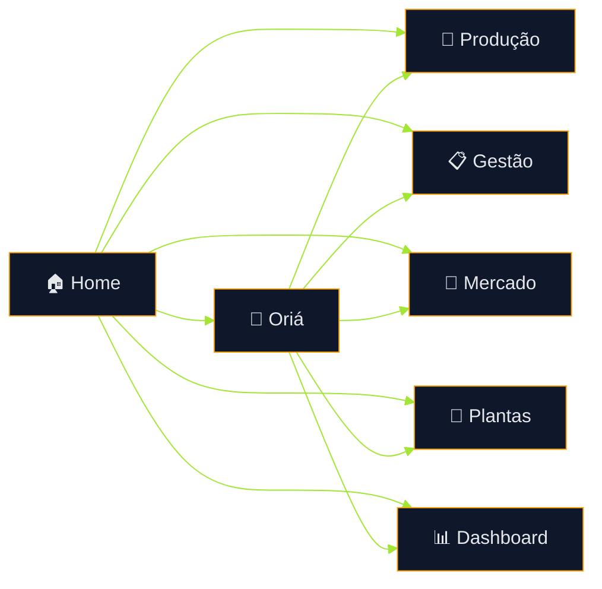
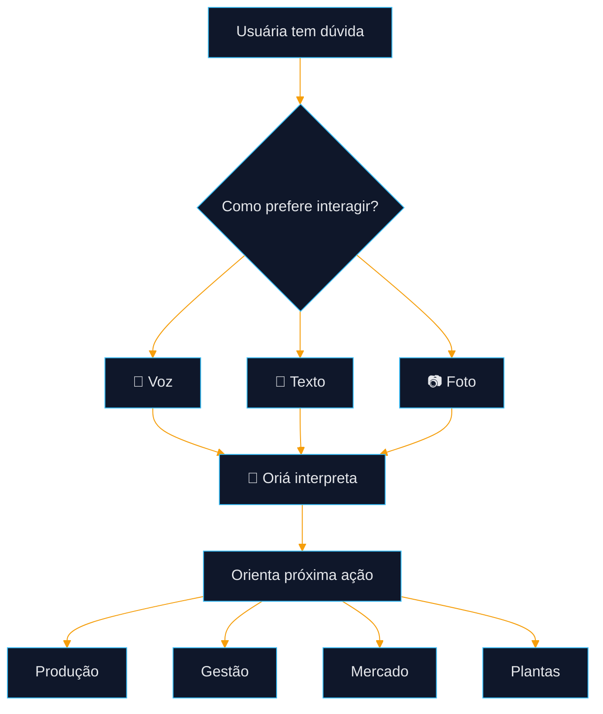
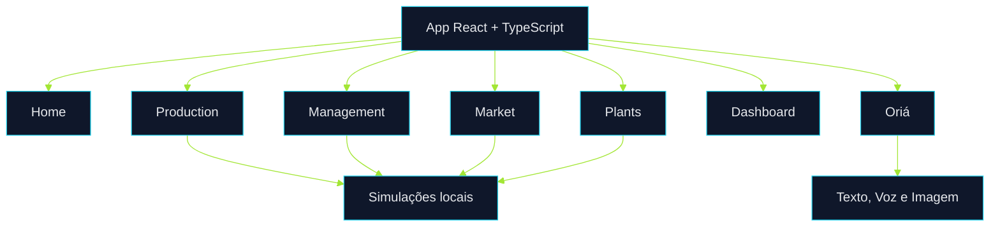

# 🌿 Terra Conecta  
## Documento Executivo Estratégico 

> Plataforma digital de assistência técnica contínua, gestão produtiva, apoio à comercialização e inteligência assistida para agricultoras familiares beneficiárias de Quintais Produtivos.

---

## Sumário

1. [Contexto Estratégico](#1-contexto-estratégico)  
2. [Tese de Valor](#2-tese-de-valor)  
3. [Visão Geral da Plataforma](#3-visão-geral-da-plataforma)  
4. [Fluxo Integrado da Usuária](#4-fluxo-integrado-da-usuária)  
5. [Porteira para Dentro — Produção](#5-porteira-para-dentro--produção)  
6. [Gestão Produtiva Simplificada](#6-gestão-produtiva-simplificada)  
7. [Porteira para Fora — Mercado](#7-porteira-para-fora--mercado)  
8. [Oriá — Assistente Rural Inteligente](#8-oriá--assistente-rural-inteligente)  
9. [Módulo Plantas](#9-módulo-plantas)  
10. [Dashboard Operacional](#10-dashboard-operacional)  
11. [Experiência de Uso e Inclusão Digital](#11-experiência-de-uso-e-inclusão-digital)  
12. [Arquitetura Funcional](#12-arquitetura-funcional)  
13. [Impacto Esperado](#13-impacto-esperado)  
14. [Roadmap Evolutivo](#14-roadmap-evolutivo)  
15. [Conclusão Executiva](#15-conclusão-executiva)

---

# 1. Contexto Estratégico

A agricultura familiar possui papel central na segurança alimentar, na geração de renda local e no fortalecimento social de comunidades rurais. Apesar dessa relevância, muitas produtoras ainda enfrentam uma rotina marcada por baixa previsibilidade, assistência técnica descontínua, dificuldade de organização produtiva e barreiras no acesso a canais de comercialização.

Na prática, a produtora precisa tomar decisões todos os dias: quando plantar, quando irrigar, como identificar sinais de problema na planta, como organizar a colheita, como separar produtos para venda, como planejar entregas e como estimar renda. Quando essas decisões são tomadas sem suporte contínuo, aumentam os riscos de perda, retrabalho, baixa regularidade produtiva e menor renda.

O **Terra Conecta** surge como uma tecnologia social digital para reduzir essa lacuna. A plataforma organiza a jornada da produtora em módulos simples, visuais e práticos, permitindo que ela tenha apoio durante todo o ciclo: da produção ao mercado.

A proposta não é criar um sistema complexo ou distante da realidade do campo. O objetivo é entregar uma ferramenta de uso direto, com linguagem simples, ícones grandes, cores por função e apoio inteligente por meio da **Oriá**, a assistente rural da plataforma.

---

# 2. Tese de Valor

O Terra Conecta parte de uma premissa clara: **produzir bem exige orientação, organização e acesso a mercado**.

A plataforma entrega valor ao transformar atividades dispersas em fluxos guiados. Em vez de exigir que a usuária compreenda sistemas complexos, ela oferece caminhos visuais para resolver problemas concretos.

## Valor para a agricultora

- apoio técnico no momento da dúvida;
- organização da produção;
- redução de perdas;
- melhor preparo para venda;
- acompanhamento de tarefas;
- estímulo à geração de renda;
- autonomia digital progressiva.

## Valor para o projeto

- padronização mínima da assistência;
- melhor acompanhamento operacional;
- possibilidade futura de dados consolidados;
- replicabilidade em outros territórios;
- fortalecimento da política pública associada aos Quintais Produtivos.

## Valor institucional

O Terra Conecta pode funcionar como ponte entre assistência técnica, organização produtiva e inclusão digital. Isso amplia a capacidade de acompanhamento e melhora a visibilidade sobre resultados, desafios e oportunidades da operação.

---

# 3. Visão Geral da Plataforma

O sistema é organizado em módulos complementares. Cada módulo resolve uma parte específica da jornada, sem concentrar tudo em uma tela única e confusa.

| Módulo | Finalidade | Papel na Jornada |
|---|---|---|
| 🏠 **Home** | Entrada principal | Centraliza atalhos visuais e reduz fricção |
| 🌱 **Produção** | Porteira para dentro | Planejar, plantar, cuidar, molhar, colher e organizar |
| 📋 **Gestão** | Controle simples | Anotar, acompanhar, melhorar e evitar perdas |
| 🛒 **Mercado** | Porteira para fora | Feira, instituição, separação, entrega e renda |
| 🌿 **Plantas** | Apoio visual | Foto, sintomas e orientação inicial |
| 📊 **Dashboard** | Visão operacional | Alertas, indicadores, atividades e pendências |
| 🤖 **Oriá** | Assistente rural | Voz, texto, foto e orientação contextual |

A plataforma foi pensada para crescer de forma incremental. Primeiro, entrega uma experiência visual e simulada com fluxos coerentes. Depois, pode evoluir para dados reais, autenticação, persistência, analytics e integrações externas.

---

# 4. Fluxo Integrado da Usuária

## Como o fluxo funciona

A usuária entra pela **Home**, que funciona como painel inicial simples. A partir dela, acessa diretamente a área correspondente à necessidade do momento.

Se precisa cuidar do quintal, entra em **Produção**.  
Se precisa registrar, acompanhar ou evitar perdas, entra em **Gestão**.  
Se precisa vender, separar produtos ou organizar entrega, entra em **Mercado**.  
Se percebe problema em uma planta, entra em **Plantas** ou aciona a **Oriá**.

A Oriá atua como camada transversal, podendo orientar, explicar, sugerir próximos passos e encaminhar a usuária para o módulo mais adequado.

---

# 5. Porteira para Dentro — Produção

O conceito de **porteira para dentro** representa tudo que ocorre antes da comercialização: planejamento, plantio, manejo, irrigação, colheita e organização interna da produção.

No Terra Conecta, esse eixo é materializado no módulo **Produção**, que apresenta etapas simples e tocáveis.

## Etapas da Produção

| Etapa | Função |
|---|---|
| **Planejar** | Definir cultivo, período e cuidados iniciais |
| **Plantar** | Acompanhar início do ciclo produtivo |
| **Cuidar** | Observar folhas, pragas, crescimento e manejo |
| **Molhar** | Apoiar irrigação e controle de água |
| **Colher** | Orientar ponto de colheita e redução de perdas |
| **Organizar** | Separar produção para consumo, venda ou entrega |

## Fluxo interno da produção

## Como a usuária interage

Cada etapa possui:
- indicador de avanço;
- checklist de tarefas;
- simulação de status;
- botão para pedir ajuda à Oriá;
- ações rápidas como foto e orientação por voz;
- bloco de anotação local.

## Resultado esperado

O módulo ajuda a reduzir improvisos e esquecimento de tarefas críticas. A usuária passa a visualizar o ciclo produtivo como uma sequência simples de ações, com prioridade clara e apoio no momento certo.

---

# 6. Gestão Produtiva Simplificada

O módulo **Gestão** traduz controle produtivo em ações simples. Ele não foi pensado como uma planilha ou sistema administrativo pesado, mas como uma ferramenta de acompanhamento visual para apoiar decisões.

## Áreas principais

| Área | Objetivo |
|---|---|
| **Anotar** | Registrar informações essenciais |
| **Acompanhar** | Ver andamento da produção |
| **Melhorar** | Identificar pontos de evolução |
| **Evitar perdas** | Antecipar problemas operacionais |

## Recursos da Gestão

- checklist interativo;
- indicadores visuais;
- percentuais de avanço;
- salvamento local de observações;
- tarefas com status;
- simulações de risco e atenção.

## Por que isso importa

Muitas perdas acontecem por falta de acompanhamento simples. A gestão visual permite que a produtora entenda rapidamente o que está pendente, o que já foi feito e o que precisa de atenção.

A proposta é criar uma rotina mínima de controle, sem burocracia, capaz de melhorar previsibilidade e reduzir desperdícios.

---

# 7. Porteira para Fora — Mercado

O conceito de **porteira para fora** representa a conexão entre produção e venda. Produzir com qualidade é apenas parte do desafio; a produtora também precisa organizar oferta, preparar produtos, acessar compradores, entregar no prazo e acompanhar renda.

O módulo **Mercado** foi criado para apoiar essa etapa.

## Frentes do módulo Mercado

| Frente | Finalidade |
|---|---|
| **Feira** | Preparar venda local |
| **Instituição** | Apoiar venda para escolas, associações ou compras públicas |
| **Separar** | Organizar produtos, quantidades e qualidade |
| **Entregar** | Planejar escoamento e logística |
| **Renda** | Estimar receita e acompanhar ganhos |

## Fluxo comercial

## Simulações do módulo

Cada tela de mercado apresenta:
- estimativa de valor;
- percentual de preparo;
- checklist de ações;
- status de atenção;
- orientação por voz;
- acesso à Oriá.

## Resultado esperado

O módulo apoia a produtora a transformar produção em renda de forma mais organizada. Isso melhora a regularidade de vendas, reduz falhas de entrega e fortalece canais locais e institucionais.

---

# 8. Oriá — Assistente Rural Inteligente

A **Oriá** é a camada de inteligência, orientação e acolhimento da plataforma. Ela foi pensada para reduzir barreiras de uso e facilitar o acesso à informação.

## Formas de interação

| Canal | Uso |
|---|---|
| 🎤 **Voz** | Para usuárias que preferem falar em vez de escrever |
| 💬 **Texto** | Para dúvidas diretas |
| 📷 **Foto** | Para mostrar planta, folha, fruto ou problema |
| 🔊 **Resposta falada** | Para facilitar compreensão e acessibilidade |

## Exemplos de perguntas

- “Minha planta está amarela.”
- “O que eu preciso fazer hoje?”
- “Quando posso colher?”
- “Como separo produtos para feira?”
- “Quanto posso vender?”
- “Minha entrega está pronta?”

## Papel da Oriá no fluxo

## Valor estratégico

A Oriá aumenta a adoção da plataforma porque oferece suporte no formato mais natural para a usuária. Ela transforma o sistema em uma experiência conversacional e reduz dependência de navegação tradicional.

---

# 9. Módulo Plantas

O módulo **Plantas** responde a uma necessidade prática: identificar sinais visuais e orientar próximos passos.

## Funcionalidades

- upload ou captura de foto;
- seleção visual de sintomas;
- resultados orientativos;
- botão para falar com Oriá;
- respostas com linguagem simples.

## Fluxo

## Objetivo

Permitir resposta rápida em campo, especialmente quando a produtora percebe manchas, ressecamento, amarelamento, pragas ou dúvidas sobre o estado da planta.

---

# 10. Dashboard Operacional

O **Dashboard** é uma tela de visão rápida. Ele sintetiza a operação para que a usuária entenda, em poucos segundos, onde precisa agir.

## Informações exibidas

- cuidados do dia;
- alertas;
- indicadores simples;
- progresso de atividades;
- últimos movimentos;
- ações rápidas.

## Benefício

O Dashboard funciona como “painel do dia”. Ele evita que a usuária precise entrar em todos os módulos para entender a situação geral.

---

# 11. Experiência de Uso e Inclusão Digital

A aplicação foi desenhada para usuárias que podem ter diferentes níveis de alfabetização, familiaridade digital e acesso à tecnologia.

## Princípios aplicados

- mobile first;
- botões grandes;
- ícones claros;
- cores por categoria;
- pouco texto por tela;
- ações diretas;
- feedback visual;
- navegação curta.

## Organização por cores

| Cor | Função |
|---|---|
| Azul | Oriá, voz, orientação e suporte |
| Verde | Produção, cuidado e progresso |
| Amarelo | Mercado, venda e renda |
| Terra | Organização, colheita e logística |

## Resultado

A interface ensina pelo uso. Mesmo sem leitura aprofundada, a usuária consegue identificar caminhos por ícone, cor e repetição visual.

---

# 12. Arquitetura Funcional

A arquitetura atual da aplicação segue uma abordagem modular simples, evitando complexidade prematura.

## Estrutura conceitual

## Estratégia técnica

O projeto começa com módulos simulados e funcionais no frontend. Essa decisão permite validar experiência, navegação, linguagem e valor operacional antes de introduzir backend, autenticação e persistência real.

## Vantagens

- menor custo inicial;
- validação rápida;
- menor risco técnico;
- evolução incremental;
- facilidade de refatoração futura.

---

# 13. Impacto Esperado

## Impacto econômico

- aumento de renda;
- melhor organização de vendas;
- redução de perdas;
- maior previsibilidade comercial;
- fortalecimento de canais locais e institucionais.

## Impacto produtivo

- rotina mais organizada;
- ações preventivas;
- melhoria da regularidade;
- acompanhamento de tarefas;
- redução de improviso.

## Impacto social

- inclusão digital;
- autonomia produtiva;
- apoio contínuo;
- fortalecimento da agricultura familiar;
- replicabilidade em outros territórios.

## Impacto institucional

- visão consolidada do projeto;
- base para acompanhamento;
- potencial de relatórios futuros;
- melhor capacidade de tomada de decisão pública.

---

# 14. Roadmap Evolutivo

| Fase | Evolução | Objetivo |
|---|---|---|
| 1 | Protótipo funcional | Validar experiência e fluxo |
| 2 | Persistência local/servidor | Salvar dados reais |
| 3 | Autenticação | Identificar usuárias |
| 4 | Backend operacional | Processar dados e histórico |
| 5 | Analytics | Monitorar impacto e indicadores |
| 6 | Integrações | Conectar órgãos, programas e compradores |
| 7 | IA avançada | Ampliar capacidade da Oriá |

A evolução deve ser guiada por uso real, não por antecipação técnica excessiva.

---

# 15. Conclusão Executiva

O **Terra Conecta** é uma plataforma de tecnologia social desenhada para transformar a rotina produtiva de agricultoras familiares em uma jornada mais organizada, assistida e conectada ao mercado.

Sua força está em combinar:
- simplicidade de uso;
- assistência contínua;
- organização produtiva;
- suporte comercial;
- inteligência conversacional;
- potencial de escala.

Mais do que um aplicativo, o Terra Conecta representa uma infraestrutura digital leve, replicável e orientada a impacto real.

Ele conecta o quintal produtivo à renda, a agricultora à informação e a tecnologia à realidade do campo.
